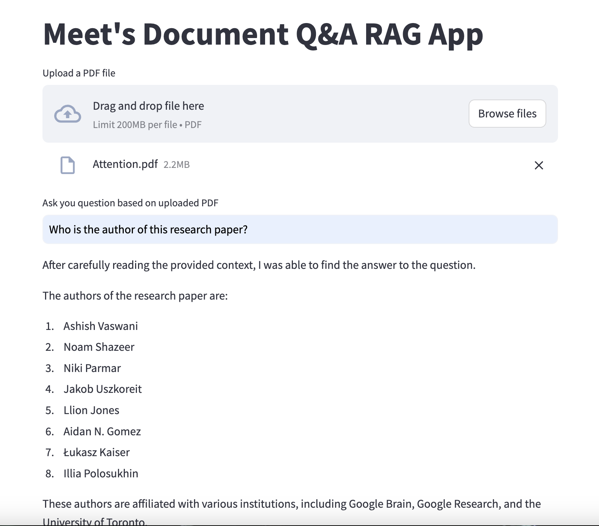
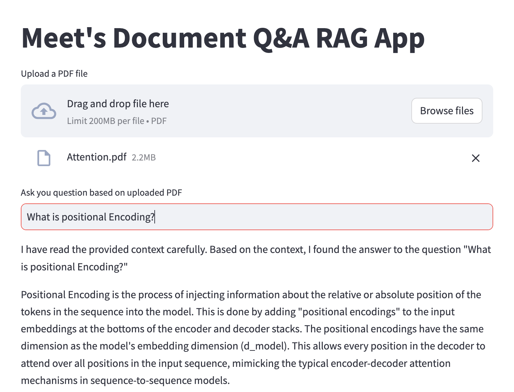

# Document-Q-A-RAG

This Document Q&A RAG Application is totally made out of open-source tools and libraries. All the tools and libraries are discussed below. 
Groq Inference Engine: It provides hardware and software platform that delivers exceptional compute speed, quality, and energy efficiency for the model inference. 
Llama3-8b: Open-source LLM model by Meta
HuggingFace BGE Embeddings: It helps to find embeddings of the document while setting up the vector store for the RAG App, which'll work as a retriever in our application.
LangChain: LangChain is a framework designed to simplify the creation of applications using large language models.
FAISS: Vector Store

Model Architecture

Importance of Application:
Semantic Search + LLM QnA can generate more context-specific and precise answers by grounding answers in specific passages from relevant documents. However, fine-tuned GPT models might generate answers based on the general knowledge embedded in the model, which might be less precise or unrelated to the question’s context.

Examples:

